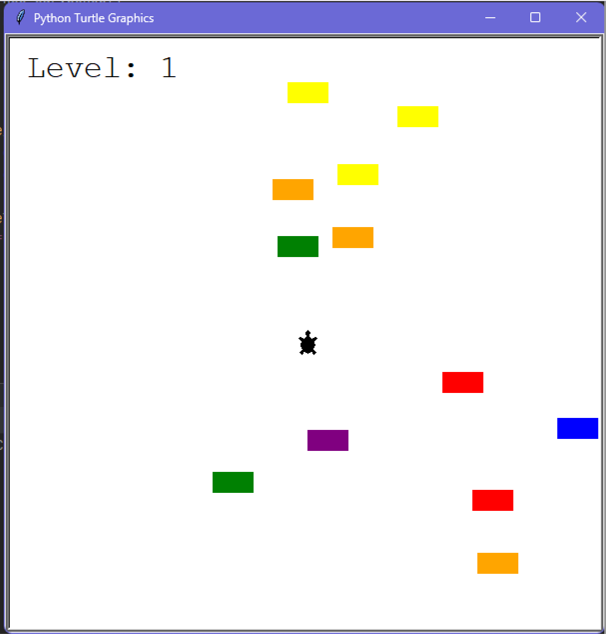
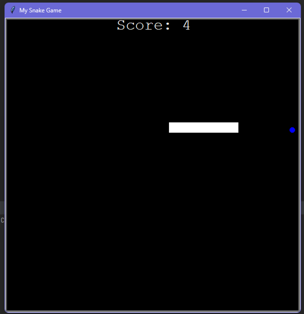
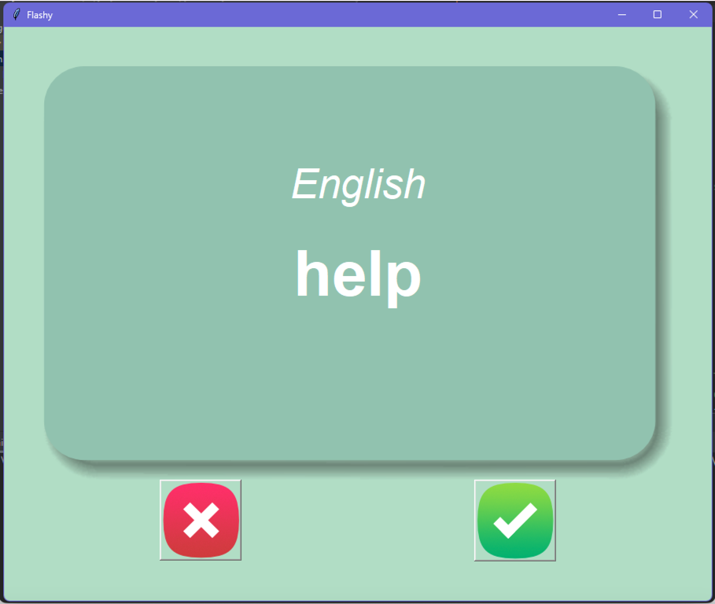
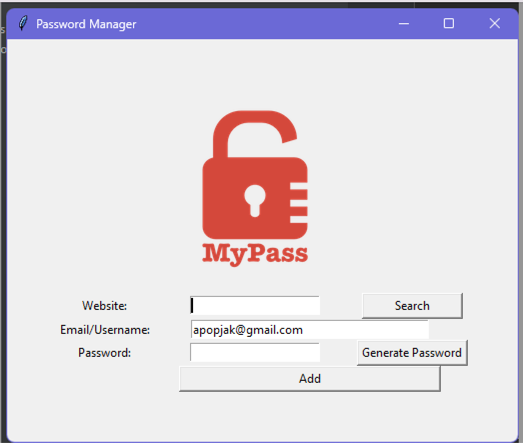

# My Projects

This repository contains a collection of my coding projects. Each project focuses on different areas of development and showcases my skills in various technologies and frameworks.

## Projects

### 1. QuizzGame

A fun and interactive quiz game that tests your knowledge across various topics. It provides an engaging experience with multiple-choice questions and real-time scoring.

### 2. Turtle Game in Tkinter

Explore the world of graphics programming by creating a captivating game using the Turtle module in Tkinter. Users can control a turtle character and navigate through exciting challenges.

### 3. Snake Game in Tkinter

Relive the classic arcade game nostalgia with a modern twist as you play the iconic Snake game built using Tkinter. Maneuver through obstacles and try to achieve the highest score.

### 4. FlashCard in Tkinter

Enhance your learning experience with this interactive flashcard app built using Tkinter. Create, study, and review customized flashcards for efficient knowledge retention.

### 5. Password Manager in Tkinter

Keep your passwords secure and easily accessible with this Tkinter-based password manager. Store and retrieve your credentials while maintaining strong encryption.

### 6. API ISS Over Your Head

Get notified by email when the International Space Station (ISS) passes over your location in the evening. This project utilizes an API to track the ISS's position and sends automated alerts.

### 7. Weather Notifier

Receive timely weather updates via email in the morning. This project alerts you if rain is forecasted during the day, helping you stay prepared for changing weather conditions.

### 8. Stock Market Email/SMS Notifier

Stay informed about stock market fluctuations with this notification system. It sends emails or SMS alerts when a stock's price changes by 5 percent, enabling you to make informed investment decisions.

### 9. QuizzGame (API version)

Enjoy an API-powered version of the QuizzGame. It offers a wide range of dynamically generated questions to challenge your knowledge across various categories.

### 10. Beautiful Soup Web Scraping Bot

Automate the process of checking Amazon prices using a web scraping bot built with Beautiful Soup. Monitor product prices and make informed purchasing decisions.

### 11. Selenium Twitter Bot

Take control of your internet speed by automatically tweeting your provider through this Selenium-powered bot whenever your internet connection slows down. Ensure timely support.

### 12. Selenium Google Forms Address Scraper

Simplify your rental property search with this Selenium bot. It scans rental websites for properties that meet your specified criteria, creates Google Forms with addresses, links, and prices, and centralizes all the information in one place.

Feel free to explore each project folder for more detailed information and instructions on how to run them.

