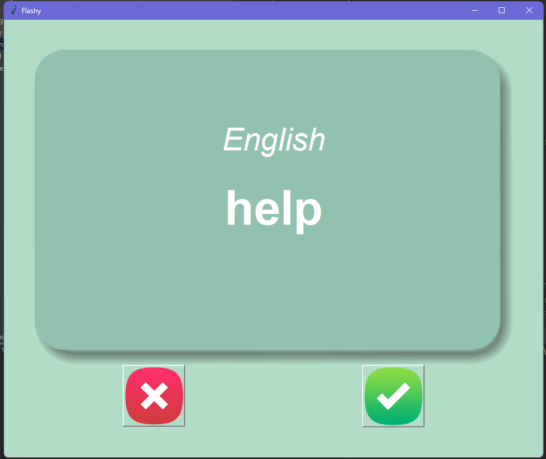

# Python Project Showcase
***
This repository contains various Python projects created using different frameworks and libraries. Each project serves a different purpose and demonstrates different aspects of Python programming. Below is a brief description of each project:

### 1. QuizGame (Tkinter)

   A simple quiz game built using Tkinter, a Python GUI toolkit. Test your knowledge with multiple-choice questions.

### 2. Amazon Price Checker (BeautifulSoup)

   This project utilizes Python and BeautifulSoup library to scrape the Amazon website and check the prices of specific products. Stay updated with the latest prices!

### 3. Twitter Complaint Bot (Selenium)

   Using Python and Selenium, this project automates the process of submitting complaints on Twitter. Express your concerns effortlessly.

### 4. Address Web Scraping (Selenium)

   Utilizing Python and Selenium, this project scrapes addresses from web pages. Extract valuable information efficiently.

### 5. Quiz-Game

   Another quiz game project, built to test your knowledge. Challenge yourself with a variety of questions.

### 6. Turtle (Tkinter)

   Explore the graphics capabilities of Python with this Turtle project. Create stunning visuals and drawings using the Turtle module.
    

### 7. Snake (Tkinter)

   Enjoy the classic Snake game implemented using Tkinter. Control the snake and try to eat as much food as possible without hitting the walls or yourself.

    
### 8. Flashcards (Tkinter)

   This project demonstrates a flashcard application built with Tkinter. Study and memorize information effectively using digital flashcards.
    

### 9. Password Manager (Tkinter)

   Securely store and manage your passwords with this password manager built using Tkinter. Safeguard your sensitive information.

### 10. API ISS Overhead Email Sender

This project utilizes an API to determine the International Space Station's current position and sends an email notification when it is overhead your location.

### 11. Weather Email Notifier

Stay updated with the weather conditions using this project. It sends email notifications with the latest weather information for a specified location.

### 12. Stock Market SMS Notifier

Get real-time stock market updates via SMS using this project. Stay informed about your favorite stocks with automatic notifications.

